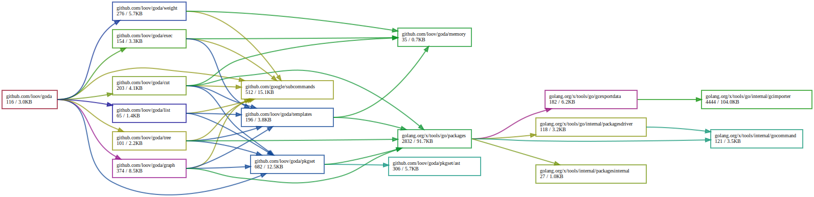

# Goda

Goda is a Go dependency analysis toolkit. It contains tools to figure out what your program is using.

_Note: the exact syntax of the command line arguments has not yet been finalized. So expect some changes to it._

Cool things it can do:

```
# draw a graph of packages in github.com/loov/goda
goda graph "github.com/loov/goda/...:root" | dot -Tsvg -o graph.svg

# draw a dependency graph of github.com/loov/goda
goda graph -cluster -short "github.com/loov/goda" | dot -Tsvg -o graph.svg

# list dependencies of github.com/loov/goda
goda list "github.com/loov/goda/...:noroot"

# list dependency graph that reaches flag package, including std
goda graph -std "reach(github.com/loov/goda/..., flag:root)" | dot -Tsvg -o graph.svg

# list packages shared by github.com/loov/goda/pkgset and github.com/loov/goda/cut
goda list "shared(github.com/loov/goda/pkgset, github.com/loov/goda/cut)""

# list packages that are only imported for tests
goda list "test=1(github.com/loov/goda/...) - test=0(github.com/loov/goda/...)"

# list packages that are imported with `purego` tag
goda list -std "purego=1(github.com/loov/goda/...)"

# list packages that are imported for windows and not linux
goda list "goos=windows(github.com/loov/goda/...) - goos=linux(github.com/loov/goda/...)"

# list how much memory each symbol in the final binary is taking
goda weight -h $GOPATH/bin/goda

# show the impact of cutting a package
goda cut ./...

# print dependency tree of all sub-packages
goda tree ./...

# print stats while building a go program
go build -a --toolexec "goda exec" .
```

Maybe you noticed that it's using some weird symbols on the command-line while specifying packages. They allow for more complex scenarios.

The basic syntax is that you can specify multiple packages:

```
goda list github.com/loov/goda/... github.com/loov/qloc
```

By default it will select all the packages and dependencies of those packages. You can select only the packages with `:root` and without the roots `:noroot`. For example:

```
goda list github.com/loov/goda/...:root
goda list github.com/loov/goda/...:noroot
```

You can also do basic arithmetic with these sets. For example, if you wish to ignore all `golang.org/x/tools` dependencies:

```
goda list github.com/loov/goda/... - golang.org/x/tools/...
```

`shared` subcommand lists shared dependencies:

```
goda list shared(github.com/loov/goda/exec, github.com/loov/goda/graph)
```

The functionality can also be combined:

```
# list packages used by github.com/loov/goda
# excluding golang.org/x/tools/..., but not their dependencies
goda list github.com/loov/goda/...:noroot - golang.org/x/tools/...:root
```

## Graph example

Here's an example output for:

```
goda graph github.com/loov/goda/...:root | dot -Tsvg -o graph.svg
```



## How it differs from `go list` or `go mod`

`go list` and `go mod` are tightly integrated with Go and can answer simple queries with compatibility. They also serves as good building blocks for other tools.

`goda` is intended for more complicated queries and analysis. Some of the features can be reproduced by format flags and scripts. However, this library aims to make even complicated analysis fast.

Also, `goda` can be used together with `go list` and `go mod`.
